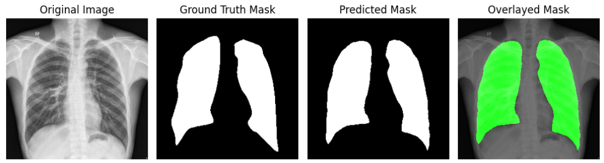

### Segmentation:
- **Model**: U-Net based architecture
- **Dataset**: [Shenzhen and Montgomery Dataset](https://www.kaggle.com/code/devanshusingh007/lungs-segmentation-unet)
- **Model Performance**:
  - **Validation Accuracy**: 0.9809
  - **Validation Dice Coefficient**: 0.9627
  - **Validation Jaccard Index**: 0.9281
  - **Validation Loss**: 0.1130

### Classification:
- **Base Model**: DenseNet169
- **Dataset**: [TBX11K](https://www.kaggle.com/datasets/vbookshelf/tbx11k-simplified)
- **Model Performance**:
  - **Validation Accuracy**: 0.9821
  - **Validation Loss**: 0.0903
  - **Validation Precision**: 1.0000
  - **Validation Recall**: 0.9636

### Future Work:
- Perform Grad-CAM for visualization
- Develop Frontend
